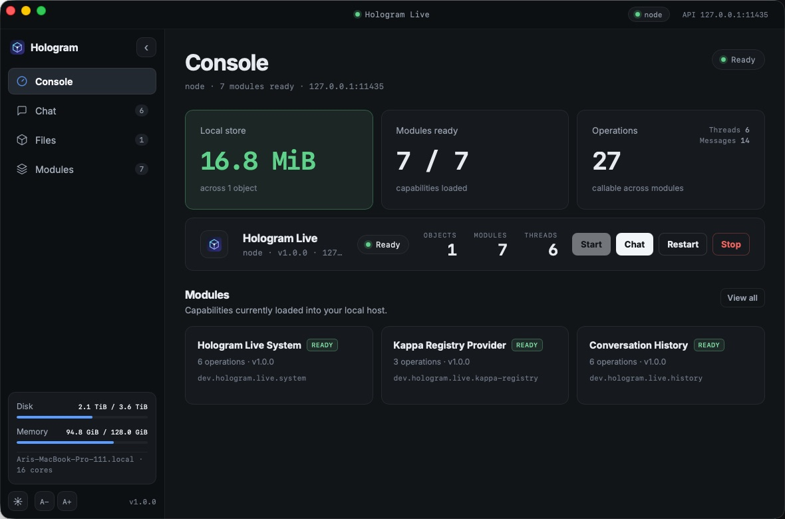

# Hologram Live



Hologram Live is a local-first module host for the Hologram ecosystem. This repository produces two independent products:

- **Hologram Server** — the standalone `hologram` binary, containing the CLI and background service.
- **Hologram Desktop** — a Tauri application that bundles `hologram` as a managed sidecar.

The current desktop experience provides a Console dashboard, multi-thread Chat with archiving, content-addressed Files, watched `.holo` Applications, and module discovery in a responsive dark/light interface. A `Cmd/Ctrl+K` command palette reaches every action, and text size is adjustable with `Cmd/Ctrl` `+`/`-`/`0`. Chat routes through a configurable inference engine: the default `echo` engine repeats your message, while `weightc` (one-shot CLI over imported `.wcpu` artifacts) and Ollama-compatible HTTP endpoints serve real model completions.

## Quick start

### Desktop application

```bash
cd apps/desktop
npm ci
npm run dev
```

The preparation step builds the server sidecar before Tauri opens. The desktop app can:

- start, restart, and stop the local Hologram service;
- create and switch between chat threads with independent, durable histories;
- upload, rename, list, and download local files;
- watch application source directories, compile/import their `.holo` archives,
  and inspect verified archive metadata;
- inspect the enabled module catalogue;
- follow the system appearance or remember a light/dark choice; and
- remain available from the system menu bar after the main window closes.

Build an installable desktop bundle with:

```bash
just desktop-build
```

### Standalone server

```bash
cargo build --release --locked --package hologram-live --bin hologram
./target/release/hologram init
./target/release/hologram start
./target/release/hologram status
./target/release/hologram modules list
```

Run the service in the foreground instead with:

```bash
./target/release/hologram serve
```

The default configuration and local endpoint are:

```text
~/.config/hologram/live.toml
http://127.0.0.1:11435
```

Open the endpoint for the built-in status page. API documentation is available at:

```text
http://127.0.0.1:11435/docs
http://127.0.0.1:11435/openapi.json
```

`/docs` is the self-hosted Scalar reference; `/openapi.json` is the generated OpenAPI document. Native clients use the versioned Protobuf/gRPC service on the same endpoint.

## Machine-readable CLI output

Global `--json` is supported by every CLI command and may appear before or after the subcommand. A successful command writes one JSON value to stdout, including lifecycle actions, downloads, generated files, accepted mutations, and `run --output-format text`. Diagnostics remain on stderr, while a runtime failure writes a JSON object with `code` and `message` to stdout and exits nonzero. This makes the complete CLI safe to compose with `jq`:

```bash
hologram status --json | jq -r '.status'
hologram files get blake3:... --output ./asset.bin --json | jq '.byte_length'
hologram run ./my-app --input-text 'hello' --output-format text --json | jq -r '.[]'
hologram run application.holo --output-format text --json | jq -r '.[]'
```

Help and shell-completion text retain Clap's human-readable format.

## Demo workflows

### Chat and conversation history

Create a thread, copy its returned ID, and send a message:

```bash
hologram --json history new "Demo chat"
hologram --json chat send <conversation-id> "Hello, Hologram"
hologram --json history show <conversation-id>
```

`chat send` records the user message and the assistant response as one persisted exchange. Threads retain separate histories and can be resumed from the desktop app.

The response comes from the inference engine selected in `live.toml`:

```toml
[inference]
engine = "echo"            # echo | weightc | ollama
default_model = ""         # blake3:... of an imported model (weightc) or a model tag (ollama)
weightc_path = "weightc"
ollama_endpoint = "http://127.0.0.1:11434"
request_timeout_secs = 300
resident_sessions = false  # weightc only: keep one resident enter session per conversation
max_resident_sessions = 4  # LRU cap on resident sessions
```

The default `echo` engine repeats the user message; it needs no model and no external process. The `weightc` engine shells out to `weightc ask <artifact-dir> <prompt> --json` against an imported `.wcpu` artifact, and the `ollama` engine proxies `POST /api/generate` on the configured endpoint.

With `resident_sessions = true`, the weightc engine instead keeps a supervised `weightc enter --jsonl` process per conversation, so turns reuse the live KV context instead of replaying a transcript, and only the new message crosses the wire each turn. Sessions are LRU-capped by `max_resident_sessions`; a crashed session is reported as a typed error and lazily respawned (starting fresh context) on the next turn. This mode needs a weightc build with `enter --jsonl` support. Models are managed with:

```bash
hologram models import ./tinyllama.wcpu
hologram models list
hologram models remove blake3:...
```

Threads can be archived instead of deleted. Archived threads keep their messages and their `updated_at_millis`, but drop out of the default listing:

```bash
hologram --json history archive <conversation-id>
hologram --json history list          # archived threads are omitted
hologram --json history list --all    # archived threads included
hologram --json history unarchive <conversation-id>
```

In the desktop app, hovering a thread reveals an archive button, and archived threads collapse into an `ARCHIVED` group at the bottom of the thread list.

Configuration files use schema version 2. Hologram validates the complete current
schema at startup and rejects missing fields or any other schema version instead
of guessing defaults or rewriting the file.

### Files

```bash
hologram files put ./notes.txt --media-type text/plain
hologram files list
hologram files rename blake3:... meeting-notes.txt
hologram files get blake3:... --output ./meeting-notes.txt
```

File bytes are addressed by their BLAKE3 content ID. Renaming changes only persisted filename metadata; the ID and bytes remain unchanged.

### `.holo` archives

Generate a validated source manifest interactively:

```bash
mkdir my-app
cd my-app
hologram app init
```

The generator prompts for ordered layers, their kind-specific entrypoint or surface information, the primary layer, an optional capability file, and optional child applications with delegated capability documents. It writes `hologram.json` atomically and prints the commands needed to compile and run it. For scripts and CI, provide the first layer as flags:

```bash
hologram app init ./my-app \
  --kind wasm \
  --path app.wasm \
  --entry holo_run

# Compose a previously compiled, self-contained child archive
hologram app init ./parent \
  --kind wasm --path parent.wasm --entry holo_run \
  --child worker.holo \
  --child-capabilities worker-capabilities.json
```

Use `--yes` for a minimal `app.wasm`/`holo_run` manifest. Existing manifests are preserved unless `--force` is explicit. Packaging remains a compiler choice: use `hologram compile` for a fat archive or add `--thin` for a manifest-only archive.

```bash
hologram holo fixture ./fixture.holo
hologram holo import ./fixture.holo
hologram holo list
hologram holo inspect ./application.holo
hologram holo plan ./application.holo
hologram holo verify ./application.holo
hologram holo inspect blake3:...
hologram holo plan blake3:...
hologram holo verify blake3:...
hologram holo remove blake3:...
```

#### Desktop watch loop

Open **Applications** in Hologram Desktop and choose **Add directory**, then
select a project containing `hologram.json`. The desktop compiles it immediately,
imports the successful archive into the normal local catalog, and recursively
watches the project for later changes. Builds are debounced and written to the
desktop cache rather than into the source directory.

Choose **Run** on a ready watched project, enter a text input in its inspector,
and the desktop loads the latest successful archive and displays its output.
Choose **Add .holo** to import an existing archive through the native file picker;
catalog archives use the same Run panel. Unsupported providers and denied
capabilities remain explicit runtime errors.

The Applications list is backed by the same `holo list` and `holo inspect`
operations shown above, so its archive κ, application κ, layers, capabilities,
physical sections, and verification state are not reconstructed by the web
frontend. A failed rebuild is shown on the watched project while the last good
immutable archive stays available. **Stop watching** removes only the persisted
watch registration; it does not delete the last cataloged `.holo` archive.

The stable build creates and validates v4 `.holo` archives and rejects every other physical version. The physical file starts with `HOLO`, a version and section count, then fixed 24-byte section-table entries containing each section's kind, offset, and length. Logical layers do not have separate physical headers: their ordered descriptors live in the canonical `AppManifest` section and refer to payloads by κ. Every application archive contains exactly one verified application-directory extension.

```text
.holo v4
├─ header + section table
├─ AppManifest       primary · requires · ordered layers · children
├─ Extension         verified, queryable application directory
├─ ContentBlob × N   κ71 · content bytes
├─ other sections    plans · weights · ports · certificates · metadata
└─ BLAKE3 footer
```

The closed layer kinds are `wasm`, `tensor`, `rootfs`, `view`, and v4's non-exit-bearing `inference-model`. A layer records its content κ and entrypoint plus an architecture for rootfs, surface for views, or engine identifier for model services. Fat archives embed referenced blobs; thin archives retain the same application identity while resolving content through a store. Live emits fat archives by default, supports thin output with `--thin`, executes Wasm primary layers through wasmtime, and can directly execute a Python OCI bundle carried by a rootfs layer through the experimental local container provider.

Applications request authority with an optional `capabilities.json`. This is a
human-authored compiler input, not the object embedded in the archive:

```json
{
  "schema_version": 1,
  "storage_roots": [],
  "storage_quota_bytes": 0,
  "network_fetch": false,
  "network_announce": false,
  "publish_channels": [],
  "subscribe_channels": [],
  "memory_max_bytes": 0,
  "cpu_time_per_event_ms": 0,
  "priority_weight": 0
}
```

Set `"requires": "capabilities.json"` in `hologram.json`. `compile --check`
validates the version, fields, and canonical sorted κ lists; `compile` converts
the JSON into the upstream canonical `CapabilitySet` bytes and stores that
object's κ in `AppManifest.requires`. Omitting `requires` produces the canonical
empty request. A request describes what an application needs—it is never itself
a grant. In the upstream capability contract, a scalar budget of `0` means
unbounded; use a nonzero value to request a finite ceiling. Runtime grant
enforcement now decodes this canonical request and authorizes it before any
provider prepares. Schema-v4 source manifests may pair a self-contained child
`.holo` archive with a delegated capability document; compilation binds both
canonical κ values into the parent and embeds the verified child closure in a
fat build. The planner verifies that recursive child closure—including every
child manifest, delegated capability object, requested capability object, and
layer—under one bounded κ-resolution walk. Before provider preparation, each
delegation must be admitted by its parent's effective grant and must itself
admit the child's request. Admitted children start depth-first in manifest
order under their delegated grants and stop or roll back in exact reverse
order. The current call invokes only the root primary; child primaries are
lifecycle-managed dependencies rather than independent resident applications.

Capability objects always use canonical `CapabilitySet` bytes. The canonical
empty set represents a deny-all request; zero-byte or otherwise malformed
objects are rejected even when their content address is correct.

Ordinary local execution uses the built-in baseline grant: no storage roots,
publish/subscribe channels, or network flags. A non-empty request therefore
fails with `LIVE_AUTHORIZATION_DENIED`. For an explicit local demo, provide a
separate trusted capability source as the effective grant:

```bash
hologram --json run ./application.holo \
  --development-grant ./development-grant.json \
  --input ./payload.bin | jq
```

Resident execution reads its development grant only from the service's trusted
configuration, never from a remote request. Set
`holo.development_grant = "development-grant.json"`; relative paths resolve
from `paths.config_dir`, and configuration validation rejects this mode on a
non-loopback listener. Both direct and service modes emit a warning and trace
the request κ, effective-grant κ, source, and allow/deny decision without
logging the capability document. They also synchronously append each root
request, child delegation, and child request decision to `audit.jsonl` under
the configured state directory before provider preparation. Audit rows contain
the authenticated principal, relation, application and parent identities,
request and grant identities, trusted source label, and outcome—never tokens,
source documents, roots, channels, or payload bytes. Successful raw run results
expose the same non-secret decision metadata as `requested_capabilities_kappa`,
`effective_grant_kappa`, `grant_source`, and `authorization`, so automated
checks can retain the authority evidence:

```bash
hologram --json run ./application.holo \
  --development-grant ./development-grant.json |
  jq '{authorization, grant_source, requested_capabilities_kappa, effective_grant_kappa}'
```

See the [complete `.holo` format guide](https://hologram-technologies.github.io/hologram-live/docs/holo-files) for the byte layout, section kinds, manifest schema, identity model, application directory, verification rules, and current runtime support.

Archives whose primary layer is Wasm execute in-process through wasmtime. A self-contained archive can run directly without starting the service:

```bash
# Compile a source directory in memory and run it immediately
hologram run ./my-app --input-text 'hello' --output-format text

# Or compile once and run the resulting immutable archive
hologram compile ./my-app/hologram.json -o ./my-app.holo
hologram run ./my-app.holo --input ./payload.bin
```

Wasm layers use the import-free `core-wasm-v1` contract. The module exports
`memory`, `holo_alloc(i32) -> i32`, and the function named by the layer's
manifest `entry` with signature `(i32, i32) -> i64`. `holo_run` is a generator
default, not a runtime hard-code; an archive may declare another
export such as `transform`. The packed `i64` identifies one byte output. V1 has
no WASI imports and no numeric process exit status: returning bytes is
successful completion, while a trap is `LIVE_PROTOCOL_ERROR`. Direct and
resident providers validate the declared entry during preparation and use a
fresh instance for each input.

The callable `entry` stays separate from guest-contract selection. Source
manifest schema v4 requires `contract` for Wasm layers; the compiler writes it
to the canonical, identity-bearing `aux` tag. Empty or omitted contracts are
rejected. The other accepted identifier is
`hologram:guest/component@1`:

```json
{
  "schema_version": 4,
  "primary": 0,
  "layers": [{
    "kind": "wasm",
    "path": "app.component.wasm",
    "entry": "run",
    "contract": "hologram:guest/component@1"
  }]
}
```

`hologram app init --contract hologram:guest/component@1` generates the same
field. Component archives compile, inspect, plan, and execute directly or as a
resident application; both JSON and gRPC report the normalized `contract`.
The exact Component v1 entry is `run`. Its checked-in WIT world accepts and
returns one byte list and imports nothing, so it cannot reach ambient WASI,
filesystem, network, clocks, environment, or host services. Each input gets a
fresh store while the compiled component remains warm. Runtime ceilings apply
even when capability scalars are unspecified: 64 MiB memory, 100 million fuel
units per input, 1 MiB input and output, and a two-second invocation deadline.
Nonzero admitted memory or CPU-time limits can only tighten those ceilings.
Deadline and dropped-future cancellation interrupt the isolated component
engine. Guest errors, traps, and limit failures remain typed operation errors.
There is never a fallback to core Wasm.
Unknown source identifiers are rejected before archive emission, and unknown
canonical manifest tags are invalid archives.

`hologram run` accepts a project directory, its `hologram.json`, a local
self-contained `.holo` file, or a catalog κ. Project references are compiled as
fat archives in memory and are not written or imported. Repeat `--input` for
binary file inputs or `--input-text` for UTF-8 values.

For warm, repeated execution, import and load the archive into a resident session:

```bash
hologram compile ./my-app/hologram.json -o ./my-app.holo
hologram holo import ./my-app.holo
hologram holo load blake3:...
hologram run blake3:... --input ./payload.bin
hologram holo resident
hologram holo unload blake3:...
```

The browser API exposes the same resident lifecycle at
`GET /api/v1/holo/resident`, `POST` or `DELETE`
`/api/v1/holo/{kappa}/load`, and `POST /api/v1/holo/{kappa}/run`. Run request
inputs are JSON arrays of byte arrays. Native and HTTP resident records include
`requested_capabilities_kappa`, `effective_grant_kappa`, `grant_source`, and
`authorization` alongside lifecycle counters.

The compiler emits fat archives by default. `--thin` emits the same canonical application manifest without its κ-addressed payloads:

```bash
hologram compile ./my-app/hologram.json -o ./my-app.holo
hologram compile ./my-app/hologram.json --thin -o ./my-app.thin.holo
```

With `--json`, compilation reports the three distinct identities directly:

```bash
hologram --json compile ./my-app/hologram.json -o ./my-app.holo |
  jq '{archive_kappa, archive_fingerprint, application_kappa, capabilities_kappa}'
```

`archive_kappa` is the BLAKE3 address of the complete physical file,
`archive_fingerprint` is the footer integrity value, and
`application_kappa` addresses the canonical `AppManifest`. Fat and thin files
have different archive κ values and footer fingerprints but the same
application κ and `capabilities_kappa`. The existing `kappa` returned by `holo inspect`, catalog,
resident, and run operations continues to mean the physical archive object;
inspection adds `application_kappa` when an application manifest is present.

Importing the fat archive verifies and caches its content blobs. A subsequently imported thin archive can resolve those payloads from the local κ store and use the same resident load/run commands. Direct file execution requires a fat archive because it deliberately has no external content resolver.

Compiled application archives include exactly one versioned application directory over their canonical manifest. `hologram --json holo inspect ./application.holo` inspects a local archive without importing it or starting the service; the command also accepts an imported `blake3:...` object ID. It exposes the physical `kappa`, canonical `application_kappa`, footer fingerprint, ordered layers, child applications, required capability set, model engine tags, and embedded κ-addressed blobs. The directory is re-derived and verified against the manifest and blob contents on import; missing, duplicate, malformed, or disagreeing directories are rejected. Structural v4 archives without an application manifest report no application κ and may omit the directory.

Use `holo plan` to explain whether an application can run before starting any provider. Local paths plan without the service; imported κ values plan against the local content cache. The payload-free report includes all three identities, fat/thin/hybrid packaging, the capability object, ordered layers, resolution sources, provider availability, planning limits, and stable typed blockers:

```bash
hologram --json holo plan ./application.holo |
  jq '{application_kappa, packaging, runnable, layers, blockers}'

hologram --json holo plan blake3:... |
  jq '{execution_target, resolved_object_count, resolved_bytes, runnable}'
```

An unsupported layer is still a successful plan: `runnable` is `false` and `blockers` explains the unavailable provider with a `kind`, `error_code`, and message. Malformed archives, missing catalog objects, and transport failures retain the normal typed JSON error contract.

#### AI model applications

Hologram Live now reads and writes `.holo` v4 `InferenceModel` layers. A complete model archive produced by `hologram-ai` can be imported and inspected without initializing its engine:

```bash
hologram --json ai inspect model.holo
hologram holo import model.holo
```

The inspection lists each callable service entry, its engine identifier, content κ, and whether the bundle is embedded. Model-source acquisition and R4G1 compilation remain owned by `hologram-ai`; this binary does not yet expose `hologram ai compile` or connect a model session to `hologram ai infer`. Attempting to execute a model-only archive returns `LIVE_CAPABILITY_MISSING` and names the unconnected service rather than simulating inference.

For low-level archive assembly, a source manifest can package an already-built provider bundle:

```json
{
  "schema_version": 4,
  "layers": [{
    "kind": "inference-model",
    "path": "model.bundle",
    "entry": "ai.default",
    "engine": "uor-r4"
  }]
}
```

`weightc` remains a chat execution provider over imported `.wcpu` directories. Those directories are not placed into `.holo` files until a deterministic single-blob bundle and validation contract is defined. See the [AI model application guide](https://hologram-technologies.github.io/hologram-live/docs/model-apps) and [ADR 009](specs/adrs/009-inference-model-holo-v4.md).

Before direct execution or `holo load` starts a provider, Live builds a runtime-owned application plan from the canonical manifest. It recursively resolves and re-hashes root and child manifests, requested and delegated capability objects, and every layer from embedded content or the local κ store. Shared objects are deduplicated while logical applications remain distinct, and aggregate application-depth, application-count, layer, object, and byte limits bound the complete tree. Missing or malformed nested content and cyclic paths therefore fail before provider preparation. Runtime admission first admits the root request, then proves every delegated child grant is a subset of its parent's effective grant and admits the child's request. Each decision is written through the separate audit boundary with the real CLI or service principal before provider preparation; amplification or an under-granted request returns `LIVE_AUTHORIZATION_DENIED`. A closed `LayerKind` registry then prepares and starts the complete admitted tree depth-first in manifest order. Every child provider receives only that child's delegated grant. Direct and resident calls invoke only the root primary; child primaries are managed dependencies. Normal stop and failure rollback traverse the exact reverse order, and resident status aggregates root and child layers. Wasm layers use Wasmtime behind this boundary and may have a primary position other than zero; resident status reports `state`, aggregate resident bytes, queued calls, processed calls, and non-secret authorization evidence. Repeated load and unload are idempotent. Python rootfs archives use the same lifecycle through an explicitly experimental, direct-only OCI adapter. Inference-model services can be inspected but not invoked through Live yet. Tensors, inference models without a provider, resident Python rootfs archives, and unknown rootfs payloads return a typed `LIVE_CAPABILITY_MISSING` error. The compiler/runtime/executor boundary is recorded in `specs/adrs/007-holo-compiler-runtime-execution.md` and the planning/provider contract in `specs/adrs/010-holo-application-plan-and-provider-lifecycle.md`; the Wasm guest contract is documented in `src/holo_wasm.rs` and demonstrated by `features/fixtures/wasm-app/`.

#### Python applications

Python is a compiler input, not a fifth `.holo` layer kind. Both available
profiles keep the same `module:function` entrypoint, where the function accepts
and returns `bytes`:

- schema-v4 `wasi-component` packages Python, CPython, and locked pure-Python
  wheels into an import-free `WasmCodemodule` selected by
  `hologram:guest/component@1`; it runs directly or resident without Docker;
- schema-v2 `rootfs` packages Python, native dependencies, and Linux libraries
  into an architecture-specific OCI image for the experimental direct provider.

The dependency-free teaching example is `examples/python-component-hello/`:

```console
$ hologram app init ./my-python-component \
    --template python --profile wasi-component \
    --project . --entry my_package:main --lock uv.lock
$ hologram compile examples/python-component-hello/hologram.json \
    --output python-component-hello.holo
$ hologram run python-component-hello.holo \
    --input-text Ada --output-format json
{
  "message": "Hello, Ada!",
  "name": "Ada",
  "python": "3.14.0",
  "runtime": "python-component"
}
```

This compiler invokes `componentize-py 0.25.0` through an isolated `uvx` tool
environment, removes the developer virtual environment and Python search path,
and uses `--stub-wasi`. It selects one exact wheel URL and SHA-256 for each of
the five server-release hosts, disables package indexes and source builds, and
fails with `LIVE_CAPABILITY_MISSING` on an unpinned host. The emitted component
therefore imports no WASI and runs under the existing Component v1 limits.
Install `uv`; the first compile downloads the hash-verified wheel and later
compiles may reuse its cache.
For external packages, the portable profile accepts registry records only when
`uv.lock` contains an HTTPS, SHA-256-pinned Python 3 `*-none-any.whl`. It
installs those exact wheels into a private path with indexes, dependency
re-resolution, source builds, and ambient pip/uv configuration disabled.
Native, source-only, Git, and path packages fail during `compile --check` with
guidance to use `rootfs`.

Both validation and compilation return a versioned, non-canonical provenance
report when global `--json` is active:

```console
$ hologram --json compile \
    examples/python-component-dependency/hologram.json --check \
    | jq '.build_provenance.layers[0].source \
      | {runtime, componentizer, inputs, dependencies, reproducibility}'
```

The schema records normalized SHA-256 source inputs, the complete selected
dependency-wheel inventory, CPython and componentizer pins, the exact
host-specific componentizer wheel URL/hash, build host, and target ABI. A
completed compile additionally records the observed `uvx`/`uv` versions and
the generated layer κ and byte length. `canonical: false` is deliberate: the
report is not embedded in `.holo`, so host evidence cannot silently change the
canonical application identity. Save a durable copy with
`jq '.build_provenance' > application.provenance.json`.

`examples/python-component-dependency/` demonstrates `six==1.17.0`:

```console
$ hologram compile examples/python-component-dependency/hologram.json \
    --output python-component-dependency.holo
$ hologram run python-component-dependency.holo \
    --input-text Ada --output-format json
{
  "dependency": "six-1.17.0",
  "message": "Hello, Ada!",
  "name": "Ada",
  "runtime": "python-component"
}
```

Stubbed randomness repeats one build-time seed inside an emitted component and
is not suitable for security-sensitive randomness. The pinned tool does not
offer deterministic seed control, so byte-identical component builds are not
yet claimed; the same blocker appears in the provenance report as
`reproducible: false`. Real capability-gated WASI remains a later milestone.

Run the repeatable direct-and-resident proof with:

```bash
just python-component-holo-demo
```

For the dependency-aware rootfs profile, source-manifest schema v4 turns a
locked project into an architecture-specific `rootfs` layer containing CPython,
the application, dependencies, and required Linux libraries.

For a small second application example, `examples/python-hello/` uses only the Python standard library and runs directly from its project directory:

```console
$ hologram run examples/python-hello --input-text Ada --output-format json
{
  "message": "Hello, Ada!",
  "name": "Ada",
  "runtime": "python"
}
```

The same project can be added as a watched directory in Desktop. After its Docker-backed build reaches **Ready**, choose **Run** and enter a name. Desktop verifies and retrieves the immutable catalog archive, then uses the direct executor so experimental Python rootfs applications do not depend on resident rootfs support.

The repository also includes the dependency-heavy NumPy + pandas project in `examples/python-numpy-pandas/`. A running Docker-compatible engine is required for both examples and this experimental compiler/direct executor:

```console
$ hologram compile --check examples/python-numpy-pandas/hologram.json
$ hologram compile examples/python-numpy-pandas/hologram.json \
    --output numpy-pandas.holo
$ hologram run numpy-pandas.holo \
    --input examples/python-numpy-pandas/request.json \
    --output-format json
{
  "columns": [
    "label",
    "value"
  ],
  "mean": 20.0,
  "rows": 3,
  "sum": 60.0
}
```

Both validation and compilation expose non-canonical rootfs build evidence in
JSON. Validation hashes the declared project inputs without contacting Docker:

```bash
hologram --json compile examples/python-numpy-pandas/hologram.json --check \
  | jq '.build_provenance.layers[0].source | {
      profile, target_platform, base_image, dependency_installer, inputs,
      reproducibility
    }'
```

A real compile resolves a mutable base tag through Docker's registry client,
uses the resulting `repository@sha256:digest` reference in the actual `FROM`
instruction, and records both requested and resolved references. It also adds
observed Docker client/server versions and the emitted rootfs layer κ, exact
image ID, and sizes. The report is deliberately `canonical: false` and is not
embedded in the `.holo` file; save it separately when needed:

```bash
hologram --json compile examples/python-numpy-pandas/hologram.json \
  --output numpy-pandas.holo \
  | jq '.build_provenance' > numpy-pandas.provenance.json
```

Pass `--no-build-cache` to make Docker rebuild every generated rootfs layer.
Completed provenance records `builder.cache_disabled: true`, so saved evidence
can distinguish an uncached build from the normal developer path. Compare two
uncached builds locally with one machine-readable report:

```bash
just python-rootfs-repro | jq .
just python-rootfs-repro | jq '.equal, .identities'
```

The release gate runs one uncached build on each of two independent clean
Linux runners for both `linux/amd64` and `linux/arm64`, then compares image,
rootfs-layer, application, archive, and footer identities within each target.
The architectures are intentionally not compared with each other because they
are different application artifacts. macOS and Windows server binaries can
drive a configured Docker-compatible Linux engine, but GitHub's hosted runners
do not supply one; they are release hosts, not additional rootfs build
platforms.

`compile --check` remains offline, so a mutable tag has no
`resolved_reference` until a real compile. A digest-pinned `source.base` is
already resolved and bypasses the registry lookup. Completed builds identify
the normalized Docker archive, source epoch zero, bundle schema 3, and exact
output. They still say `reproducible: false` until the clean Linux builder
matrix proves byte-identical image config and layer blobs for both supported
target architectures.

`hologram run` preserves the binary-safe `HoloRunResult` envelope by default. Add `--output-format text` for UTF-8 application output or `--output-format json` for JSON application output. One decoded result prints directly; results from multiple `--input` arguments print in order, with JSON results collected into an array. Invalid text or JSON returns a typed protocol error instead of changing the bytes.

The raw envelope keeps output and completion distinct. Core-Wasm v1 returns
`"completion":{"kind":"returned"}` because its callable returned bytes but has
no process exit code. A provider with a real process status may return
`"completion":{"kind":"exited","code":0}`. Completion and authorization
evidence are required on every current result. Traps, nonzero processes, and
other failures remain typed errors rather than successful results with invented
status values.

Generate the same schema without hand-writing JSON:

```bash
hologram app init ./my-python-app \
  --template python --profile rootfs \
  --project . --entry my_package:main --lock uv.lock --arch arm64
```

Compilation stages only `pyproject.toml`, the declared `uv.lock`, and `src/`, then installs the locked third-party dependencies in a disposable Linux builder. It does not read or copy the host `.venv`, and it does not install the local project as a wheel because uv's local-project cache metadata contains source timestamps. The final image imports the already-staged application through `/app/src`, normalizes its filesystem timestamps to epoch zero, and excludes uv and transient build layers. Direct execution validates the archive and target architecture, disables networking, mounts the container filesystem read-only, drops Linux capabilities, enables `no-new-privileges`, and applies CPU, memory, PID, temporary-storage, input/output, and 30-second wall-clock limits.

This is an intentionally explicit demo provider, not the final untrusted-workload boundary: it requires a local Docker-compatible engine with Buildx registry inspection, supports direct fat archives only, and leaves cached OCI images behind for repeat runs. Bundle schema 3 re-addresses the exact image config and ordered layers as SHA-256 blobs, emits a canonical manifest and fixed tar headers, then applies fixed-level Zstandard compression. New archives record the exact image ID, so a warm local run skips decompression and `docker image load` only when that trusted ID is already present; a cold machine still restores the image from the archive. Compile once with an optimized release binary and reuse the resulting `.holo`; debug builds spend substantially longer hashing the roughly 100 MiB archive. `just python-holo-demo` builds and uses the release CLI, with a one-time optimized link on the first invocation. Mutable `source.base` tags are resolved and bound to a registry manifest digest before the build; an already digest-pinned value skips that lookup. Repeated exports of identical config/layer bytes are now byte-identical, but uncached clean-build equality across the release matrix remains open. Capability-gated WASI and hardware-backed microVM rootfs execution remain planned. See the [Python application guide](https://hologram-technologies.github.io/hologram-live/docs/python-apps), [ADR 008](specs/adrs/008-python-rootfs-oci-provider.md), [ADR 012](specs/adrs/012-locked-python-component-dependencies.md), [ADR 014](specs/adrs/014-python-rootfs-build-provenance.md), [ADR 015](specs/adrs/015-python-rootfs-base-digest-binding.md), and [ADR 017](specs/adrs/017-normalized-python-rootfs-archive.md).

The demo writes one JSON document to stdout; progress and failures use stderr:

```bash
just python-holo-demo | jq .
just python-holo-demo | jq '.output'
just python-hello-demo | jq .

# Retain the verified archive instead of deleting the temporary artifact
just python-holo-package target/numpy-pandas.holo | jq '{archive, archive_bytes}'
target/release/hologram --json run target/numpy-pandas.holo \
  --input examples/python-numpy-pandas/request.json
```

### Inference compatibility APIs

The daemon exposes non-streaming OpenAI- and Ollama-compatible HTTP surfaces over the configured inference engine:

```bash
curl http://127.0.0.1:11435/v1/models
curl -X POST http://127.0.0.1:11435/v1/chat/completions \
  -H 'content-type: application/json' \
  -d '{"model":"echo","messages":[{"role":"user","content":"Hello"}]}'
curl -X POST http://127.0.0.1:11435/api/generate \
  -H 'content-type: application/json' \
  -d '{"model":"echo","prompt":"Hello","stream":false}'
curl http://127.0.0.1:11435/api/tags
```

Requests with `stream: true` are rejected with a typed error; token streaming requires engine support and is future work. Both surfaces sit behind the same bearer-token seam as every other module route.

### Third-party plugin modules

Beyond the built-in catalogue, the daemon hosts dynamic third-party modules as supervised subprocesses. Plugins are an explicit, sha256-pinned allowlist in `live.toml` — nothing is scanned or loaded implicitly:

```toml
[plugins]
enabled = true

[[plugins.modules]]
id = "com.example.weather"
path = "/usr/local/bin/weather-plugin"
sha256 = "<64 hex chars>"
```

Each plugin speaks a small gRPC contract (`hologram.live.plugin.v1.PluginHost`: describe/invoke/ping) over a Unix socket the daemon provides, runs under a supervised actor with a bounded mailbox and bounded restart, and receives a scrubbed environment. Its operations join the capability manifest and are reachable through the native client:

```bash
hologram plugins list
hologram plugins call com.example.weather weather.current '{"city":"Berlin"}'
```

Plugins have no host resource access in v1 — no store, config, or network mediation — and no HTTP routes; they are pure compute over JSON payloads. Wrapping plugin executables in microVMs is the documented hardening path. See `specs/adrs/005-subprocess-plugin-boundary.md`.

## Built-in modules

Trusted modules are statically linked and registered in the `builtin_modules!` catalogue in `src/modules/mod.rs`:

| Module | Current responsibility |
| --- | --- |
| `dev.hologram.live.system` | Health, capabilities, and module discovery |
| `dev.hologram.live.kappa-registry` | Local content-addressed registry provider |
| `dev.hologram.live.files` | File upload, listing, renaming, and download |
| `dev.hologram.live.holo` | `.holo` import, inspection, verification, cataloguing, and resident Wasm execution |
| `dev.hologram.live.history` | Durable conversations and messages |
| `dev.hologram.live.chat` | Conversation-backed chat over the configured inference engine |
| `dev.hologram.live.inference` | Model import, listing, and removal for the engine boundary |
| `dev.hologram.live.openai-compat` | Non-streaming OpenAI-compatible `/v1` inference API |
| `dev.hologram.live.ollama-compat` | Non-streaming Ollama-compatible `/api` inference API |
| `dev.hologram.live.control-plane` | Minimal node inventory and heartbeats |

Each module declares its stable ID, dependencies, operation IDs, HTTP routes, and OpenAPI contribution. Operators can enable a subset with `modules.enabled` in `live.toml`. Executable module behavior remains compiled Rust rather than configuration-defined code.

## Configuration

The current configuration schema is version 2. Generate a complete file with `hologram init`, inspect it with `hologram config show`, and validate the installation with `hologram doctor`.

Local structured tracing is always available. OTLP export is enabled only when a collector endpoint is configured:

```toml
[telemetry]
enabled = true
endpoint = "http://127.0.0.1:4317"
service_name = "hologram-live"
export_timeout_secs = 5
```

`OTEL_EXPORTER_OTLP_ENDPOINT` and `OTEL_SERVICE_NAME` override those values. No telemetry network connection is made when the endpoint is unset.

The client can route to local or remote authorities after a capability handshake. Non-loopback remote endpoints require HTTPS, and authentication, authorization, TLS, and integrity errors never trigger fallback to another authority.

## Architecture

```text
Tauri desktop ── managed sidecar ──┐
hologram CLI ─────── gRPC ─────────┼── Hologram service
browser/API ───── JSON/HTTP ───────┘    config · auth · telemetry · audit
                                               │
                              registry · files · .holo · history · chat
```

The kernel owns configuration, lifecycle, capability-aware routing, authenticated dispatch, tracing, audit, update coordination, and actor supervision primitives. Product behavior belongs to modules. Kameo actors are used only for long-lived mutable state or bounded background work; ordinary request handlers remain ordinary Rust code.

The source tree enforces the product boundary:

```text
src/                                  standalone server, CLI, and shared protocol/runtime
crates/hologram-application-watch/    Tauri-independent local development engine
apps/desktop/src-tauri/               thin native shell and sidecar adapter only
apps/desktop/src/                     webview frontend
```

The desktop never owns a second server implementation. Its preparation script
builds the root `hologram-live` package explicitly and copies the resulting
`hologram` executable into Tauri's ignored sidecar staging directory. The
application-watch crate owns reusable persistence and debounce behavior outside
`src-tauri`; the desktop adapter supplies user-approved paths, fixed
compile/import commands, and UI events. A cloud server build therefore needs
only Rust and the root package—no Tauri, WebKit, Node.js, or desktop source.
The `product-boundary` verification gate inspects the resolved Cargo graph and
fails if Tauri or the application-watch crate enters the standalone server.

## Releases

Server and desktop versions advance independently and create separate GitHub Releases:

- `server-v<version>` publishes standalone Linux, macOS, and Windows server archives plus `SHA256SUMS`.
- `desktop-v<version>` publishes Linux, macOS, and Windows Tauri installers.
- `docs-v<version>` deploys the versioned Astro documentation site to GitHub Pages.

The desktop installer includes a server sidecar for local operation, but it remains a desktop release. See [RELEASING.md](RELEASING.md) for version checks, tags, and the artifact matrix.

Build either product locally with:

```bash
just server-build
just desktop-build
just docs-release     # after committing the documentation version
```

## Install the server from this checkout

```bash
./install.sh
```

This builds the release binary and installs `hologram` into `~/.local/bin`. Set `HOLOGRAM_INSTALL_PREFIX` to choose a different prefix.

## Development

The server crate declares Rust 1.94 as its minimum supported version, matching Wasmtime 46's compiler floor. `rust-toolchain.toml` currently pins Rust 1.97.1 for repository development and release CI. The desktop and documentation projects also require Node.js and npm; `just` is used for the common project recipes.

Run the complete server verification path with:

```bash
just verify
```

That includes formatting, source-size policy, checks, unit tests, Clippy, public-boundary BDD scenarios, a release build, and an isolated end-to-end smoke test. The smoke test covers strict configuration validation, module discovery, file storage and renaming, `.holo` operations including resident Wasm execution, chat persistence through the default echo engine, model listing, the OpenAI/Ollama compatibility endpoints, OpenAPI generation, and shutdown.

Useful development commands:

```bash
just dev          # foreground server with automatic Rust rebuild/restart
just tauri        # Tauri development application
just docs-dev     # Astro documentation at http://127.0.0.1:54321
```

To use `just dev`, install `cargo-watch` once:

```bash
cargo install cargo-watch --locked
```

## Current limitations

The default build does not yet provide:

- enterprise identity, organizations, or RBAC storage; or
- fleet scheduling.

Chat runs against the configured inference engine (`echo` remains the default), Wasm-layer `.holo` archives—including Python Components with locked pure-Python wheels—execute resident, direct Python OCI rootfs archives execute through the experimental local container provider, and the weightc engine can keep resident per-conversation sessions. Token streaming, tensor execution, inference-model provider invocation, resident rootfs execution, native Component dependencies, capability-gated WASI, deterministic Python Component output, and the production microVM provider remain future work. Missing runtime capabilities return a typed `LIVE_CAPABILITY_MISSING` error rather than simulating success.

## Further documentation

- [Actual capabilities](ACTUAL_CAPABILITIES.md)
- [Architecture](ARCHITECTURE.md)
- [Security](SECURITY.md)
- [Dependencies](DEPENDENCIES.md)
- [Release process](RELEASING.md)
